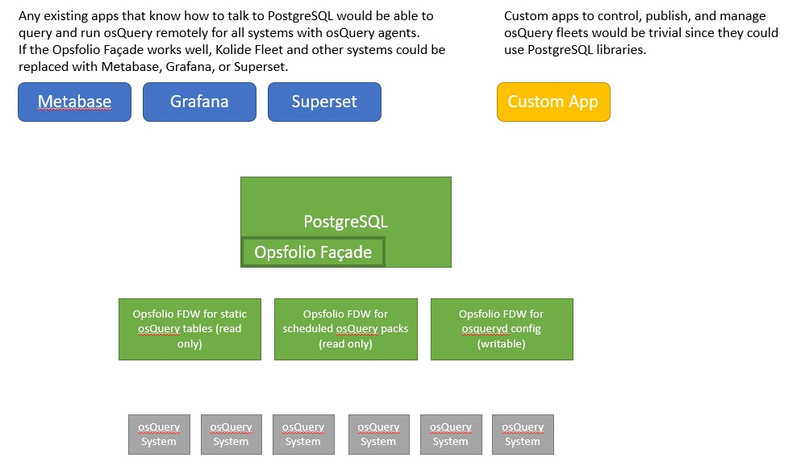

# Opsfolio Infrastructure Assurance

Opsfolio is an *infrastructure assurance* tool to help define expectations for assets and boundaries and then use tools like osQuery to ensure expectations are met.

## Implementation Strategies

* Opsfolio uses [Governed Information Model (GIM)](https://github.com/gov-suite/governed-im-rds) to create osQuery [Automatic Table Construction](https://osquery.readthedocs.io/en/stable/deployment/configuration/) configurations. See [this article](https://blog.kolide.com/build-custom-osquery-tables-using-atc-ab112a30674c) and [this gist](https://gist.github.com/FritzX6/0aa5b25e9caa232103091de31b9f5295) for elaboration.
* osQuery fleet management via PostgreSQL FDW façade. The Opsfolio FDW uses osQuery remote APIs to perform distributed queries, provide osqueryd configurations to the fleet, and provide PostgreSQL simulated tables for scheduled queries (packs). What we’re trying to do is to use existing open source tools that can be wrapped in FDWs to manage a fleet of osQuery servers. Basically, creating something SPG or Kolide Fleet except built entirely on top of PostgreSQL, FDWs, and tools like Grafana or Metabase that can sit on top of PG. The custom FDW would use existing osqueryd remote API to send and receive query data and allow anything that can read from PG to be able to collect osQuery data.

